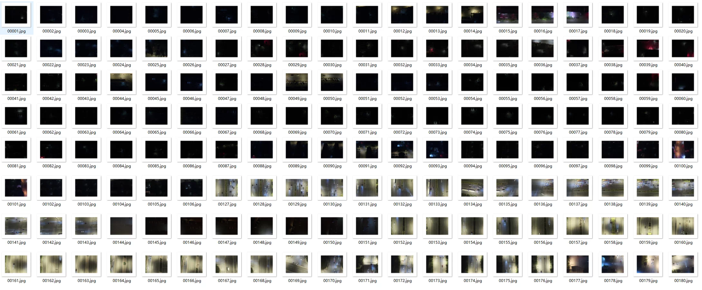
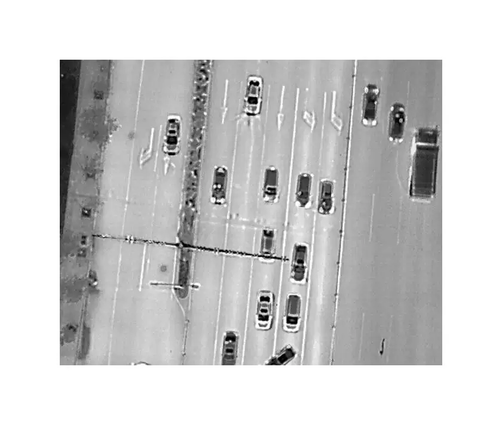

## Body

Nighttime Drone Aircraft Vehicle Detection Dual-Modality (Infrared-Visible) Dataset in YOLO Format

The DroneVehicle-Night dataset consists of 10,357 training images, 868 validation images, and 6,013 test images, each pair containing both RGB and Infrared modalities.

The source format of the dataset is provided along with two versions converted to YOLO format.

This dataset provides a total of 276,819 annotated object instances across five vehicle categories: cars, trucks, buses, vans, and freight vehicles (car; truck; bus; van; freight_car).

Samples are drawn from representative nighttime aerial photography scenes such as urban roads, residential areas, and parking lots, capturing the complexity and diversity of lighting interference.

Electronic virtual products sold are non-refundable.

## Images

Here is a pay link on Stripe ( https://buy.stripe.com/3cs8yP7sY87d0vu9AB ). Please contact me lonlonago@foxmail.com after funding $89, and I will send you a complete data files , thank you!

